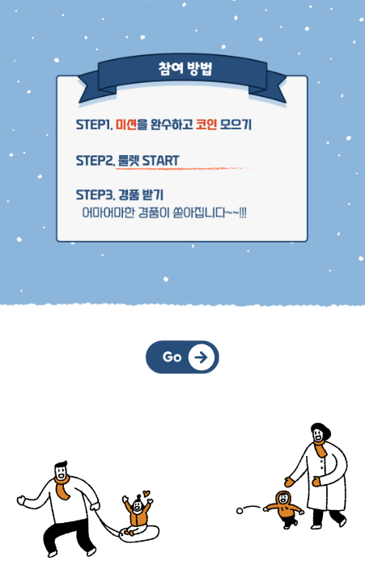
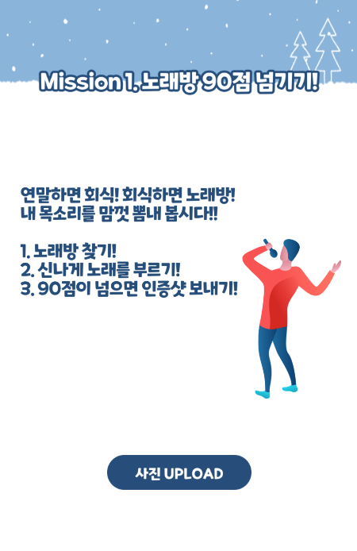
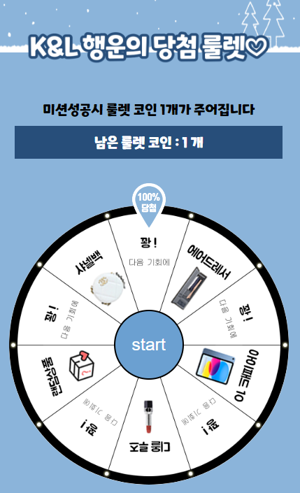

# roulette_event
- 친구 생일 기념 이벤트에 사용하기 위해 간단히 만든 미션 룰렛 이벤트 웹 페이지
- 모바일 사용에 적합한 사이즈로 개발
- 일련의 흐름을 고정해두고 이벤트 진행 (조작해놓음)
- 메인->미션설명->미션1->룰렛(무조건 꽝)->미션1 재도전->룰렛(무조건 랜덤박스)

   
## Work Flow
- 메인 이벤트 페이지   

- 이벤트 설명 페이지   

- 미션 페이지
    - 각 미션이 끝나면 미션에 대한 결과가 popup으로 뜸
    - 미션 성공시 코인을 얻고 룰렛으로 이동, 실패시 미션 재도전

- 룰렛 페이지
    - 당첨 혹은 꽝에 대한 결과 popup 포함
    - 꽝일 경우 미션 재도전, 상품일 경우 다음 미션으로 이동

   
#### 도움
- 디자인 도움: 한나

#### 참고 자료
- 디자인 자료: [미리캔버스](https://www.miricanvas.com/)
- 룰렛 [https://jnoony-code.tistory.com/19](https://jnoony-code.tistory.com/19)
- 팝업창 [https://m.blog.naver.com/h2s0_/222758449113](https://m.blog.naver.com/h2s0_/222758449113)
- 로딩 [https://www.w3schools.com/howto/howto_css_loading_buttons.asp](https://www.w3schools.com/howto/howto_css_loading_buttons.asp)