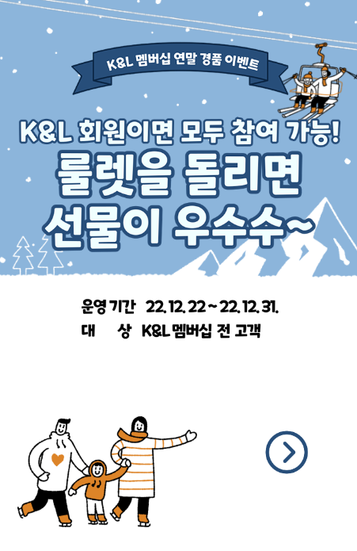

# Roulette Event
- 친구 생일 기념 이벤트에 사용하기 위해 이미지 위주로 간단히 만든 미션 룰렛 이벤트 웹 페이지
- 모바일 사용에 적합한 임의의 사이즈로 개발 (안드로이드 기준)
- 구름 IDE를 사용해 웹사이트를 실행함 (구름IDE !)
- 일련의 흐름을 고정해두고 이벤트 진행 (조작해놓음)
    - 메인 -> 미션설명 -> 미션1 -> 룰렛(무조건 꽝) -> 미션1 재도전 -> 룰렛(무조건 랜덤박스) -> 마지막 미션 -> 성공!

   
## Work Flow
#### 메인 이벤트 페이지    

#### 이벤트 설명 페이지    

#### 미션 페이지
- 각 미션이 끝나면 미션에 대한 결과가 popup으로 뜸
- 미션 성공시 코인을 얻고 룰렛으로 이동, 실패시 미션 재도전    

#### 룰렛 페이지
- 당첨 혹은 꽝에 대한 결과 popup 포함
- 꽝일 경우 미션 재도전, 상품일 경우 다음 미션으로 이동    

### 느낀점/배운점
- 친구 놀리는 마음으로 재밌게 만들 수 있었다.
- JavaScript를 조작해보는 재밌는 경험이었다.
- Jinja는 수정하고 싶은 부분만 쏙 빼서 쓸 수 있어 정말 좋은 툴 같다.
- 사진을 실제 인식하는 과정은 포함되지 않았지만 다음에는 추가해봐도 재밌을 것 같다.

### 도움
- 디자인 도움: 한나

### 참고 자료
- 디자인 자료: [미리캔버스](https://www.miricanvas.com/)
- 룰렛 [https://jnoony-code.tistory.com/19](https://jnoony-code.tistory.com/19)
- 팝업창 [https://m.blog.naver.com/h2s0_/222758449113](https://m.blog.naver.com/h2s0_/222758449113)
- 로딩 [https://www.w3schools.com/howto/howto_css_loading_buttons.asp](https://www.w3schools.com/howto/howto_css_loading_buttons.asp)
